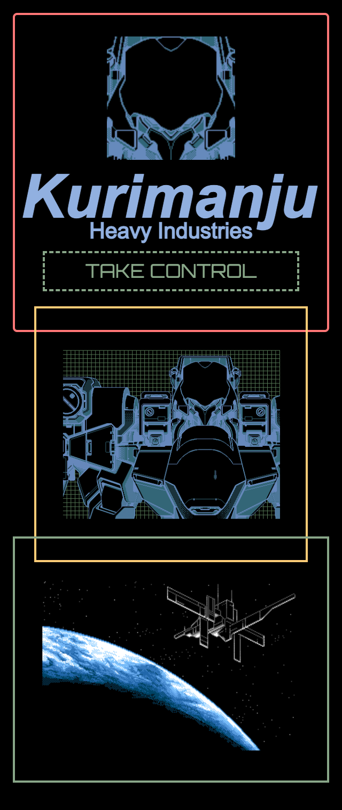
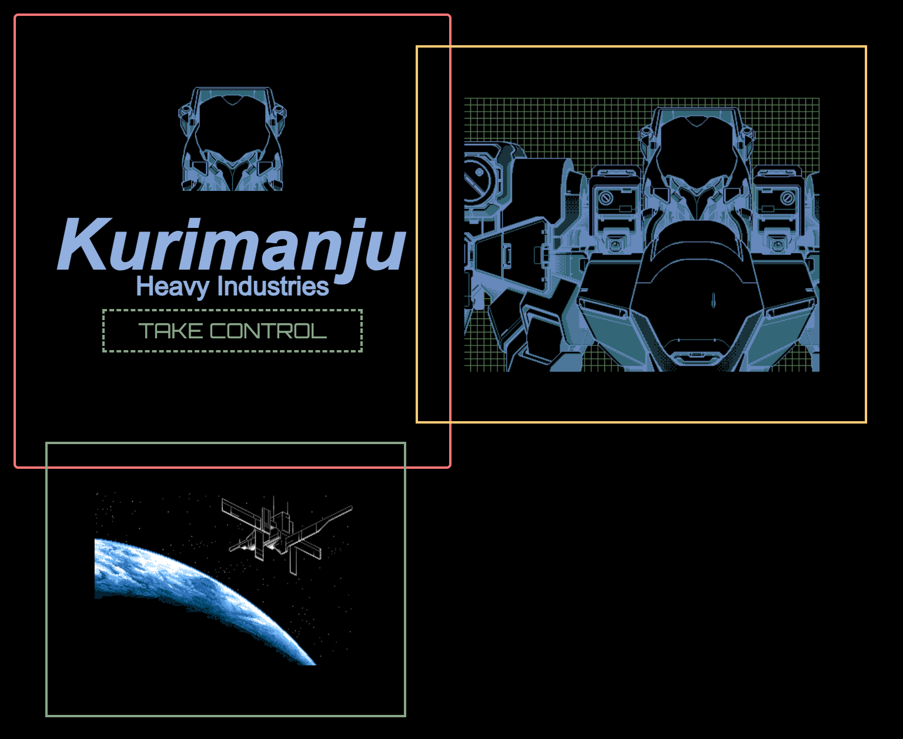
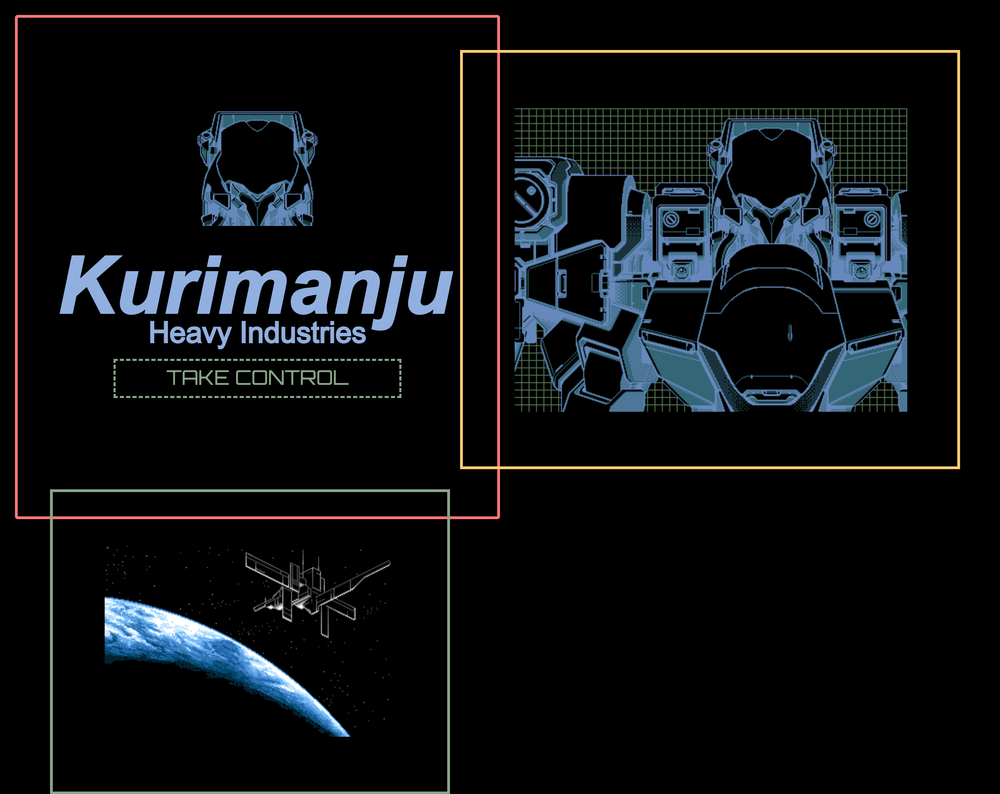
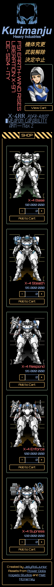
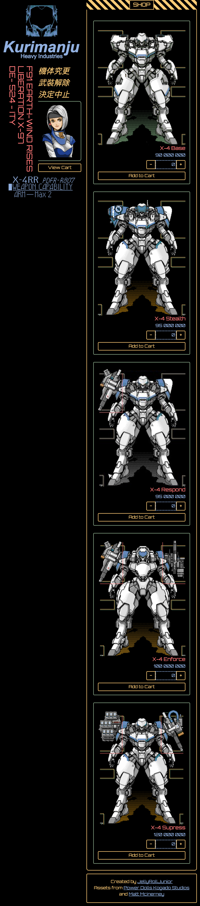
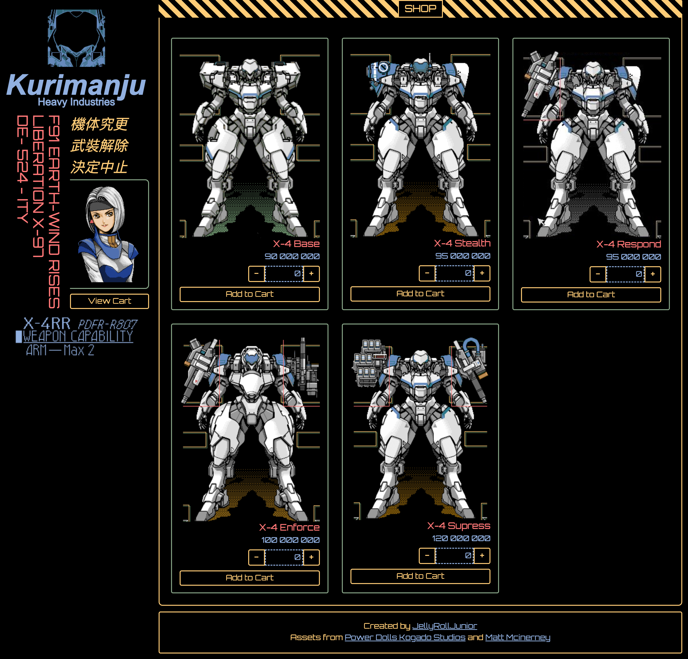
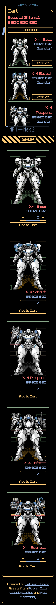
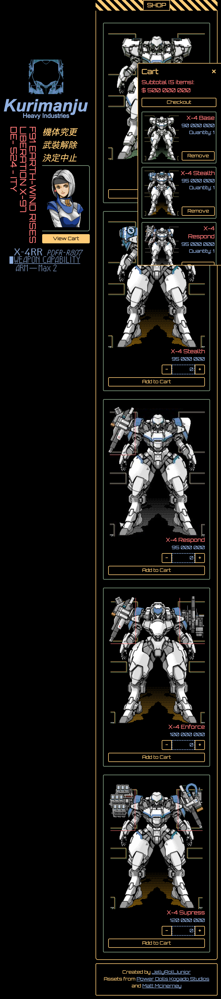
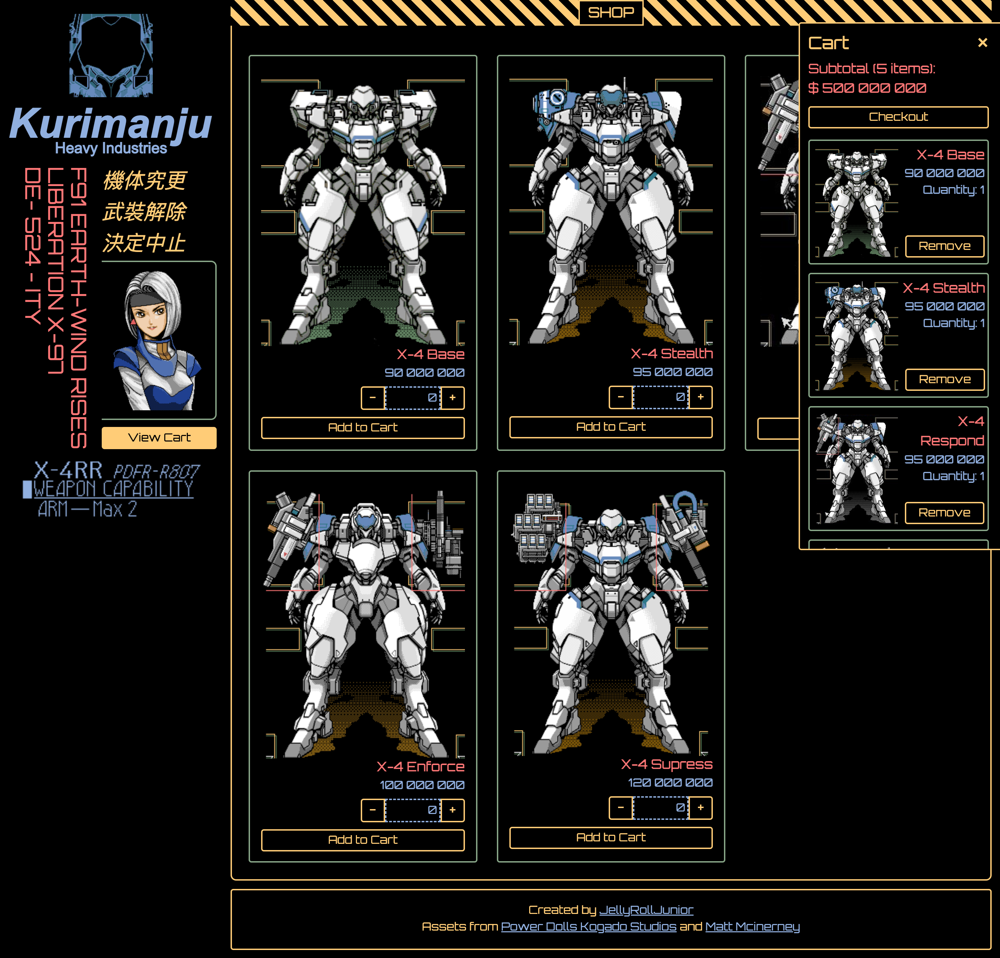

<h1 align="center">Kurimanju Heavy Industries Storefront</h1>
<h3 align="center">Purchase mechas from Kurimanju Heavy Industries <a href=''>here</a>!</h3>

    

### Features
- Stylish homepage and storefront designed by me!
- Button hover animations
- Slide-in, slide-out shopping cart implmented with react state
- Fixed position header and cart

### Stack
- React - JSX - Vitest
- CSS - CSS modules
- HTML
- Git / GitHub
- Netlify

## Learning Outcomes
- First time using react router
- First time using CSS modules (composes is kinda neat)
- First time using vitest for a project (mocking components, mocking functions, render, snapshot testing, and userEvent)
- First time playing around with animations!
- Netlify redirects :O

## Responsive Layout Showcase

| Mobile | Tablet | Laptop  | 
|  ----- |  ----- |  ------ | 
| 320px  | 768px  | 1440px  | 
|  |  |  |
|  |  |  |
|  |  |  |

## Retrospective (aka yapping)
I'm really proud of the design I created. Its a futuristic mechanical theme! 

I had a bit of trouble fiddling with CSS modules. I'm unsure how to make full use of theming with colors.module.css when I cannot use composes with standard elements (like html, button, div). Guess I would have to link it from index.html. Actually thats probably it.

I'm also thinking my testing is not comprehensive enough. I will try to test more cases and read some more testing code. 

## Acknowledgements

| Usage   | Source   |
| ------- | -------------- |
| Font | [Matt Mcinerney](https://www.theleagueofmoveabletype.com/orbitron?style=light) |
| Assets  | Power Dolls: Detachment of Limited Line Service |
| Specs | [The Odin Project](https://www.theodinproject.com/lessons/node-path-react-new-shopping-cart) |
